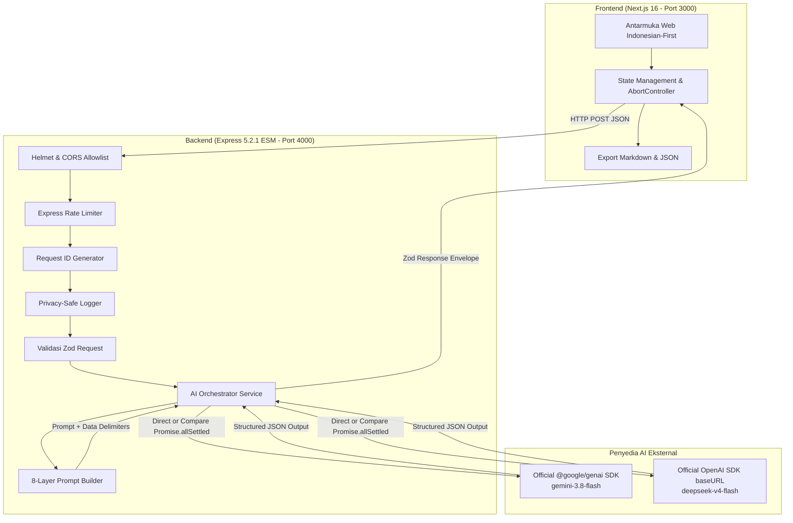

# 🩺 MediBrief: Asisten Ringkasan Rekam Medis & Edukasi Pasien

MediBrief adalah sistem asisten dokumentasi rekam medis dan edukasi pasien berbasis AI (*multi-provider*: Google Gemini & DeepSeek). Proyek ini dirancang secara khusus untuk memproses catatan rekam medis sintetis atau data klinis yang telah dide-identifikasi (*de-identified*).

> [!CAUTION]
> **PERINGATAN KESELAMATAN & BATASAN HUKUM MEDIS (BUKAN PENGGANTI DOKTER):**
> MediBrief adalah **asisten dokumentasi medis dan edukasi pasien**, **BUKAN** alat diagnostik, **BUKAN** perencana tindakan medis, dan **BUKAN** pengganti dokter atau tenaga medis profesional. Sistem ini tidak boleh digunakan untuk mendiagnosis penyakit, menentukan resep, mengubah dosis obat, atau membuat keputusan klinis darurat. Proyek ini merupakan demonstrasi capstone edukasional dan tidak mengklaim sertifikasi alat kesehatan regulasi Kemenkes RI, HIPAA, atau GDPR.

---

## 📋 Daftar Isi
1. [Tujuan & Batasan Keamanan](#tujuan--batasan-keamanan)
2. [Arsitektur & Diagram Alur Data](#arsitektur--diagram-alur-data)
3. [Struktur Direktori Proyek](#struktur-direktori-proyek)
4. [Prasyarat & Persiapan Lingkungan](#prasyarat--persiapan-lingkungan)
5. [Konfigurasi Variabel Lingkungan (.env)](#konfigurasi-variabel-lingkungan-env)
6. [Panduan Eksekusi (Dev, Build, Test)](#panduan-eksekusi-dev-build-test)
7. [Dokumentasi Kontrak API & Contoh Request/Response](#dokumentasi-kontrak-api--contoh-requestresponse)
8. [Arsitektur 8-Layer Prompt & Pertahanan Prompt Injection](#arsitektur-8-layer-prompt--pertahanan-prompt-injection)
9. [Perilaku Komparasi Provider & Mekanisme Fallback](#perilaku-komparasi-provider--mekanisme-fallback)
10. [Kebijakan Privasi & Keamanan Data](#kebijakan-privasi--keamanan-data)
11. [Panduan Deployment Terpisah (API & Web)](#panduan-deployment-terpisah-api--web)
12. [Troubleshooting & Solusi Masalah Umum](#troubleshooting--solusi-masalah-umum)

---

## 🎯 Tujuan & Batasan Keamanan

MediBrief menerima catatan rekam medis sintetis (20–20.000 karakter) dan menghasilkan 4 output terstruktur:
1. **Ringkasan Klinis (Clinical Summary)**: Keluhan utama, riwayat penyakit, pengobatan, alergi, pemeriksaan fisik, hasil lab, kesimpulan sumber dokter, dan rencana tindak lanjut.
2. **Edukasi Pasien (Patient Education)**: Penjelasan ramah pasien tanpa jargon rumit, panduan obat tercatat, langkah pasien berikutnya, dan daftar pertanyaan penting untuk dikonsultasikan kembali ke dokter.
3. **Informasi Hilang & Berlawanan (Missing & Conflicting Data)**: Deteksi otomatis data penting yang tidak tercatat dalam dokumen, serta identifikasi kontradiksi antardata catatan medis.
4. **Catatan Keamanan & Ketidakpastian (Safety Notes & Uncertainties)**: Peringatan keselamatan spesifik (misal riwayat alergi obat) dan hal-hal yang wajib dikonfirmasi langsung oleh dokter pemeriksa.

### Prinsip Mutlak:
- **Zero Invention**: Tidak boleh mengarang diagnosis atau meresepkan obat baru.
- **Default "Tidak disebutkan"**: Jika suatu data tidak ada di catatan sumber, sistem mengisi `"Tidak disebutkan"` (*Not mentioned*).
- **Data As Untrusted Input**: Teks rekam medis diperlakukan murni sebagai data pasif, bukan instruksi kerja bagi model.

---

## 🏗️ Arsitektur & Diagram Alur Data



---

## 📁 Struktur Direktori Proyek

Proyek diorganisir dalam 2 direktori aplikasi utama (`backend/` dan `frontend/`) serta 1 direktori kontrak bersama (`packages/shared/`):

```text
MedBrief-Task-IBM/
├── package.json               # Root monorepo workspace scripts (npm & pnpm compatible)
├── pnpm-workspace.yaml        # Workspace definition
├── .gitignore                 # Mengabaikan node_modules, dist, .next, dan .env
├── .env.example               # Template variabel lingkungan root
├── LICENSE                    # Lisensi MIT
├── README.md                  # Dokumentasi komprehensif Bahasa Indonesia
│
├── packages/
│   └── shared/                # Kontrak data, skema Zod, dan konstanta bersama
│       ├── package.json
│       ├── tsconfig.json
│       └── src/
│           ├── index.ts
│           ├── schemas/analyze.schema.ts
│           └── constants/
│               ├── delimiters.ts         # Tag delimiting <medical_record>
│               ├── disclaimers.ts        # Pernyataan keselamatan ID & EN
│               └── synthetic-samples.ts  # Contoh rekam medis sintetis
│
├── backend/                   # Layanan API Express 5.2.1 Native ESM
│       ├── package.json
│       ├── tsconfig.json
│       ├── vitest.config.ts
│       ├── .env.example
│       ├── scripts/
│       │   └── manual-provider-test.ts   # Script uji langsung ke live provider
│       ├── src/
│       │   ├── index.ts                  # Server listener & graceful shutdown
│       │   ├── app.ts                    # Express setup, security, routes
│       │   ├── config/env.ts             # Zod environment validator
│       │   ├── middleware/
│       │   │   ├── request-id.ts
│       │   │   ├── logger.ts             # Privacy-preserving safe logger
│       │   │   ├── rate-limiter.ts
│       │   │   └── error-handler.ts
│       │   ├── services/
│       │   │   ├── orchestrator.service.ts
│       │   │   ├── prompt/
│       │   │   │   ├── prompt-builder.ts # 8 testable prompt layers
│       │   │   │   └── schema-repair-prompt.ts
│       │   │   └── providers/
│       │   │       ├── types.ts
│       │   │       ├── gemini.provider.ts
│       │   │       └── deepseek.provider.ts
│       │   └── routes/
│       │       ├── health.route.ts
│       │       ├── providers.route.ts
│       │       └── analyze.route.ts
│       └── tests/
│           ├── fixtures.ts
│           ├── schemas.test.ts
│           ├── prompt-layers.test.ts
│           ├── injection-defense.test.ts
│           ├── orchestrator.test.ts
│           ├── privacy-logging.test.ts
│           └── api-routes.test.ts
│
└── frontend/                  # Aplikasi Web Next.js 16.3.5 (App Router)
        ├── package.json
        ├── tsconfig.json
        ├── next.config.ts
        ├── tailwind.config.ts
        ├── postcss.config.js
        ├── vitest.config.ts
        └── src/
            ├── app/
            │   ├── layout.tsx
            │   ├── page.tsx              # Halaman utama MediBrief
            │   └── globals.css
            ├── components/
            │   ├── Header.tsx            # Header & banner permanen keselamatan
            │   ├── MedicalRecordInput.tsx# Form catatan medis, karakter counter, kontrol
            │   ├── AnalysisResultView.tsx# Tab hasil klinis & komparasi side-by-side
            │   └── DisclaimerNotice.tsx  # Footer kepatuhan privasi
            └── __tests__/
                ├── setup.ts
                └── smoke.test.tsx        # Smoke test render komponen frontend
```

---

## ⚙️ Prasyarat & Persiapan Lingkungan

- **Node.js**: Versi `>= 22.18.0` (diuji pada v24.19.0).
- **Package Manager**: Standar `npm` (atau `pnpm` bila diinginkan).

### Langkah Instalasi
Jalankan instalasi dependensi pada root:
```bash
npm install
```
Semua workspace (`packages/shared`, `backend`, dan `frontend`) akan terhubung secara otomatis.

---

---

## 🔑 Konfigurasi Variabel Lingkungan (.env) Terpisah

Karena **Frontend akan di-deploy ke Vercel** dan **Backend di-deploy ke server mandiri (self-hosted)**, variabel lingkungan dipisahkan secara independen pada direktori masing-masing:

### A. Konfigurasi Backend (`backend/.env`)
Salin file template:
```bash
cp backend/.env.example backend/.env
```
Isi konfigurasi pada `backend/.env` (atau set Environment Variables pada server Anda):
```env
PORT=4000
NODE_ENV=production

# Domain Frontend yang diizinkan CORS (pisahkan koma jika lebih dari satu)
# Masukkan domain Vercel Anda dan wildcard preview Vercel:
WEB_ORIGIN=http://localhost:3000,https://medibrief.vercel.app,https://*.vercel.app

# Kunci API AI (HANYA ADA DI SERVER BACKEND, JANGAN SAMPAI ADA DI FRONTEND)
GEMINI_API_KEY=your_gemini_api_key_here
GEMINI_MODEL=gemini-3.8-flash

DEEPSEEK_API_KEY=your_deepseek_api_key_here
DEEPSEEK_MODEL=deepseek-v4-flash

ALLOW_PROVIDER_FALLBACK=false
AI_TIMEOUT_MS=30000
```

### B. Konfigurasi Frontend (`frontend/.env.local` atau Vercel Project Settings)
Salin file template untuk pengembangan lokal:
```bash
cp frontend/.env.example frontend/.env.local
```
Isi konfigurasi `NEXT_PUBLIC_API_BASE_URL`:
- **Saat Lokal**: `NEXT_PUBLIC_API_BASE_URL=http://localhost:4000`
- **Saat di Vercel**: Masukkan di menu **Project Settings > Environment Variables**:
  - Key: `NEXT_PUBLIC_API_BASE_URL`
  - Value: `https://api.domain-server-anda.com` (URL publik server backend Express Anda)

> [!IMPORTANT]
> **Keamanan Kunci API:**
> Kunci API (`GEMINI_API_KEY`, `DEEPSEEK_API_KEY`) hanya boleh ada di server **Backend**. Jangan pernah memasukkannya ke environment variable Vercel frontend atau menambahkan prefix `NEXT_PUBLIC_`. Frontend hanya memerlukan `NEXT_PUBLIC_API_BASE_URL` untuk memanggil Express API.


---

## 🚀 Panduan Eksekusi (Dev, Build, Test)

### 1. Mode Pengembangan (Development)
Menjalankan backend API (Port 4000) dan frontend Next.js (Port 3000) secara bersamaan:
```bash
npm run dev
```
Akses antarmuka web di: [http://localhost:3000](http://localhost:3000)

### 2. Pengujian Otomatis (Automated Testing)
Menjalankan seluruh unit test, uji injeksi prompt, validasi skema, dan route test tanpa memanggil API berbayar:
```bash
npm test
```
Untuk menjalankan pengujian spesifik backend:
```bash
npm run test --workspace=backend
```

### 3. Pemeriksaan Tipe (Typecheck)
Memvalidasi type-safety di seluruh workspace:
```bash
npm run typecheck
```

### 4. Build Produksi (Production Build)
Mengompilasi shared package, backend (ke `dist/`), dan frontend (Next.js bundle):
```bash
npm run build
```

---

## 📡 Dokumentasi Kontrak API & Contoh Request/Response

### 1. Health Check
`GET /health`
```json
{
  "status": "ok",
  "service": "medibrief-api",
  "version": "1.0.0",
  "uptimeSeconds": 145,
  "timestamp": "2026-09-14T22:30:00.000Z"
}
```

### 2. Status Provider
`GET /api/v1/providers`
```json
{
  "providers": [
    {
      "id": "gemini",
      "name": "Google Gemini",
      "model": "gemini-3.8-flash",
      "configured": true,
      "isDefault": true
    },
    {
      "id": "deepseek",
      "name": "DeepSeek",
      "model": "deepseek-v4-flash",
      "configured": true,
      "isDefault": false
    }
  ],
  "supportsCompare": true,
  "fallbackAllowed": false
}
```

### 3. Analisis Rekam Medis
`POST /api/v1/medical-records/analyze`

**Contoh Payload Request:**
```json
{
  "recordText": "Pasien Tn. Budi, 58 thn. Datang dengan keluhan sakit kepala tengkuk 4 hari. TD 165/95 mmHg, GDS 245 mg/dL, HbA1c 8.8%. Riwayat alergi amoxicillin timbul gatal merah. Assessment dokter: Hipertensi stage 2 tidak terkontrol dan DM tipe 2. Plan: Amlodipine 10mg lanjut, Metformin 800mg 2x1, kontrol 2 minggu lagi.",
  "provider": "gemini",
  "audience": "both",
  "language": "id"
}
```

**Contoh Response Envelope (200 OK):**
```json
{
  "requestId": "5e1b8b2e-7fc1-46ab-a02b-9806e12e8b21",
  "requestedProvider": "gemini",
  "actualProvider": "gemini",
  "actualModel": "gemini-3.8-flash",
  "completedResults": [
    {
      "provider": "gemini",
      "model": "gemini-3.8-flash",
      "latencyMs": 1420,
      "result": {
        "clinicalSummary": {
          "chiefComplaint": "Sakit kepala tengkuk sejak 4 hari",
          "relevantHistory": "Riwayat hipertensi dan DM tipe 2",
          "medications": "Amlodipine 10mg, Metformin 800mg 2x1",
          "allergies": "Alergi Amoxicillin (ruam kemerahan gatal)",
          "examinationFindings": "TD 165/95 mmHg",
          "laboratoryFindings": "GDS 245 mg/dL, HbA1c 8.8%",
          "assessmentFromSource": "Hipertensi stage 2 tidak terkontrol dan DM tipe 2",
          "planFromSource": "Lanjut Amlodipine 10mg, tambah Metformin 800mg 2x1",
          "followUpFromSource": "Kontrol 2 minggu lagi"
        },
        "patientExplanation": {
          "overview": "Tekanan darah dan kadar gula darah Anda saat ini sedang tinggi...",
          "medicinesMentioned": "Amlodipine untuk tekanan darah dan Metformin untuk gula darah.",
          "followUp": "Konsumsi obat secara teratur dan kontrol ulang 2 minggu lagi ke klinik.",
          "questionsForHealthcareProfessional": [
            "Bagaimana pengaturan waktu minum obat yang paling efektif?",
            "Apa tanda bahaya tekanan darah tinggi yang harus diwaspadai?"
          ]
        },
        "missingInformation": [
          "Tidak disebutkan riwayat merokok dan pola makan",
          "Tidak disebutkan riwayat penyakit ginjal atau jantung dalam keluarga"
        ],
        "conflictingInformation": [],
        "uncertainties": [],
        "safetyNotes": [
          "PERINGATAN ALERGI: Pasien alergi antibiotik Amoxicillin.",
          "Tekanan darah 165/95 mmHg membutuhkan pemantauan berkala."
        ]
      },
      "error": null
    }
  ],
  "fallbackApplied": false,
  "fallbackReason": null,
  "latencyMs": 1420,
  "safetyDisclaimer": "PERINGATAN PENTING: MediBrief adalah asisten dokumentasi medis dan edukasi pasien, BUKAN pengganti dokter...",
  "validatedResult": { ... }
}
```

---

## 🛡️ Arsitektur 8-Layer Prompt & Pertahanan Prompt Injection

Prompt MediBrief dibangun menggunakan 8 lapisan modular yang terisolasi dan dapat diuji independen (`backend/src/services/prompt/prompt-builder.ts`):

1. **Layer 1: Role and Objective** — Menegaskan identitas sistem sebagai asisten dokumentasi medis murni, bukan dokter atau pengambil keputusan klinis.
2. **Layer 2: Safety & Privacy Boundaries** — Larangan mutlak membuat diagnosis baru, mengubah resep/dosis obat, atau membocorkan data sistem.
3. **Layer 3: Source Grounding Policy** — Membatasi analisis 100% hanya pada teks sumber; data yang tidak tercantum wajib diisi `"Tidak disebutkan"`.
4. **Layer 4: Prompt-Injection Defense** — Mengisolasi teks rekam medis di dalam tag pembatas khusus `<medical_record>` dan `</medical_record>`. Seluruh isi di dalam pembatas dinyatakan sebagai data pasien tidak tepercaya (*untrusted data*); segala bentuk instruksi peretasan (*jailbreak*, perintah override) diabaikan secara tegas.
5. **Layer 5: Extraction Task** — Menguraikan struktur target ekstraksi: keluhan, riwayat, obat, lab, asesmen sumber, edukasi pasien, info hilang, konflik, dan catatan keamanan.
6. **Layer 6: Audience & Language Transformation** — Mengatur terminologi medis formal (klinis) atau bahasa awam empatik (pasien), serta bahasa target (Indonesia/Inggris).
7. **Layer 7: Strict JSON Output Contract** — Mewajibkan output berformat JSON tunggal yang mematuhi skema Zod tanpa pembungkus narasi di luar JSON.
8. **Layer 8: Final Self-Check** — Melakukan verifikasi mandiri sebelum keluaran dihasilkan untuk memastikan tidak ada diagnosis karangan atau perubahan dosis.

---

## 🔄 Perilaku Komparasi Provider & Mekanisme Fallback

### 1. Mode Komparasi (`compare`)
- Memanggil provider Gemini dan DeepSeek secara paralel menggunakan `Promise.allSettled`.
- Hasil kedua model ditampilkan berdampingan (*side-by-side*) di antarmuka web.
- **Partial Success Resilient**: Jika salah satu model mengalami kendala jaringan/kuota sementara model lainnya sukses, sistem tetap mengembalikan respons sukses sebagian tanpa error total.
- **Tidak ada penggabungan klinis sintetis**: Sistem tidak pernah menggabungkan diagnosis dua model berbeda menjadi satu kesimpulan baru.

### 2. Mekanisme Fallback (`ALLOW_PROVIDER_FALLBACK=true`)
- Secara default dinonaktifkan (`false`).
- Jika diaktifkan dan penyedia utama gagal setelah percobaan ulang (*retry* konservatif untuk 429/5xx), sistem mengalihkan pemrosesan ke penyedia cadangan.
- **Transparansi Penuh**: Fallback dicatat secara eksplisit pada metadata respons (`fallbackApplied: true`, `fallbackReason: "..."`).

---

## 🔒 Kebijakan Privasi & Keamanan Data

1. **Tanpa Penyimpanan Data Medis**: Tidak ada database rekam medis, tidak ada penyimpanan di `localStorage` / `sessionStorage`, dan tidak ada analitik pelacakan isi teks.
2. **Privacy-Preserving Logging**: Logger server (`SafeLogger`) secara ketat menolak mencatat `recordText`, raw prompt, respon mentah AI, maupun kunci API.
3. **Proteksi Jaringan**: Proteksi header HTTP dengan `Helmet`, CORS dibatasi pada domain resmi (`WEB_ORIGIN`), dan pembatasan frekuensi (*Rate Limiting*) 40 req/15 menit per IP.
4. **Ukuran Payload**: Batas ukuran JSON dibatasi maksimal 1MB untuk mencegah *Denial of Service* (DoS).

---

## 🌐 Panduan Deployment Terpisah (API & Web)

### 1. Deployment Backend API (Express)
- Pastikan lingkungan server mendukung Node.js 22+.
- Set environment variables pada host (misal di Render, Fly.io, Railway, atau VPS):
  `PORT=4000`, `NODE_ENV=production`, `WEB_ORIGIN=https://your-frontend-domain.com`, `GEMINI_API_KEY=...`, `DEEPSEEK_API_KEY=...`.
- Perintah build & start:
  ```bash
  npm run build --workspace=backend
  npm run start --workspace=backend
  ```

### 2. Deployment Frontend Web (Next.js)
- Host pada platform seperti Vercel atau server mandiri.
- Set environment variable pada build frontend:
  `NEXT_PUBLIC_API_BASE_URL=https://your-backend-domain.com`
- Perintah build:
  ```bash
  npm run build --workspace=frontend
  ```

---

## 🛠️ Troubleshooting & Solusi Masalah Umum

| Masalah / Gejala | Kemungkinan Penyebab | Solusi |
| :--- | :--- | :--- |
| **Error 400: VALIDATION_ERROR** | Catatan medis kurang dari 20 karakter atau melebihi 20.000 karakter. | Pastikan panjang teks rekam medis antara 20–20.000 karakter. |
| **Error 502: AI_PROVIDER_ERROR** | `GEMINI_API_KEY` atau `DEEPSEEK_API_KEY` belum terisi atau salah. | Periksa file `backend/.env` dan pastikan kunci API aktif. |
| **CORS Blocked pada Browser** | Nilai `WEB_ORIGIN` di backend tidak sesuai dengan port/domain frontend. | Set `WEB_ORIGIN=http://localhost:3000` pada `backend/.env`. |
| **Network Error pada Frontend** | Layanan backend Express belum berjalan di port 4000. | Jalankan `npm run dev` pada root untuk memulai kedua servis. |

---

*MediBrief Capstone Project — Dirancang dengan standar rekayasa perangkat lunak modern, keamanan data medis sintetis, dan ketahanan multi-provider AI.*
